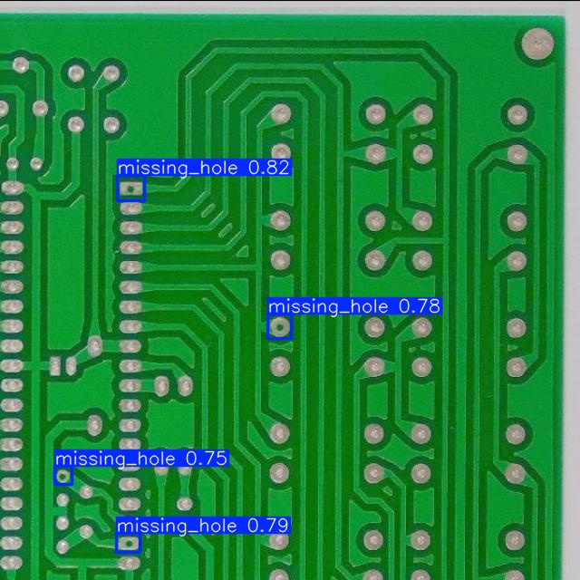
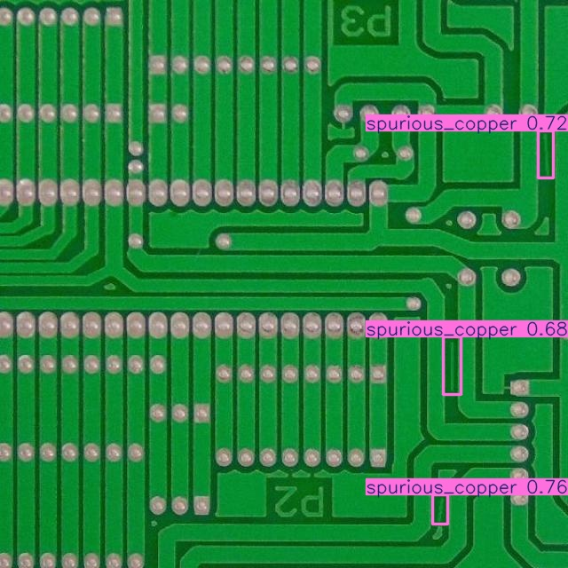
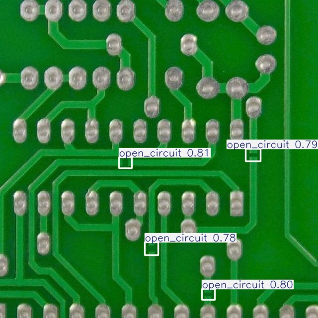

# PCB Vision AI: Industrial Defect Detection System

An end-to-end Computer Vision solution for automated quality control in PCB manufacturing. This system uses a custom-trained YOLOv11n model to identify six common manufacturing defects in real-time.

## 🚀 Live Demo
- **Frontend:** https://pcb-vision-ai-industrial-defect-det.vercel.app/
- **API Documentation:** https://pcb-vision-ai-industrial-defect-y67a.onrender.com/docs

## 🧠 System Architecture
The project follows a decoupled architecture for high scalability:
- **Backend:** FastAPI (Python) hosted on **Render**.
- **Frontend:** React + Vite + Tailwind CSS hosted on **Vercel**.
- **AI Model:** YOLOv11n (You Only Look Once) trained on a custom PCB dataset.

## 🛠️ Tech Stack
- **Deep Learning:** PyTorch, Ultralytics YOLOv11n.
- **Backend:** FastAPI, Uvicorn, Python 3.10.
- **Frontend:** React.js, Tailwind CSS (v3.4.17), Lucide Icons, Framer Motion.
- **DevOps:** GitHub Actions (CI/CD), Render Blueprint.

## 🔍 Supported Defect Classes
The model is optimized to detect:
1. Missing Hole
2. Mouse Bite
3. Open Circuit
4. Short
5. Spur
6. Spurious Copper

## 📂 Project Structure

.
├── backend/
│   └── app/            # FastAPI logic & inference wrappers
├── frontend/           # React + Vite application
├── models/             # Trained .pt model weights
├── src/                # Shared configurations & utility scripts
└── outputs/            # Inference result storage

⚙️ Installation & Local Setup
Backend
cd backend/app

pip install -r requirements.txt

uvicorn main:app --reload

Frontend
cd frontend

npm install

npm run dev

👤 Author
Ashfi Nazmus Rakib
Computer Science & Technology Student
Focus: Deep Learning & Intelligent Computing Systems

Here is the output:

